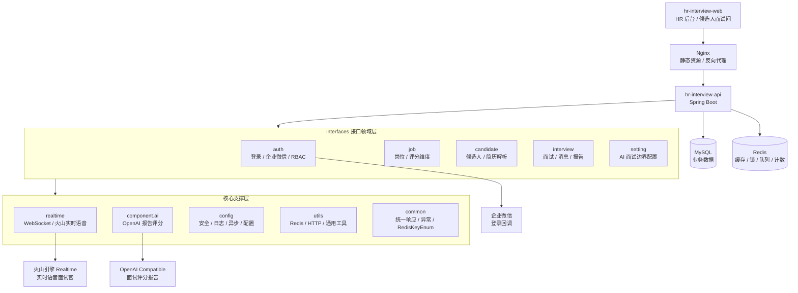
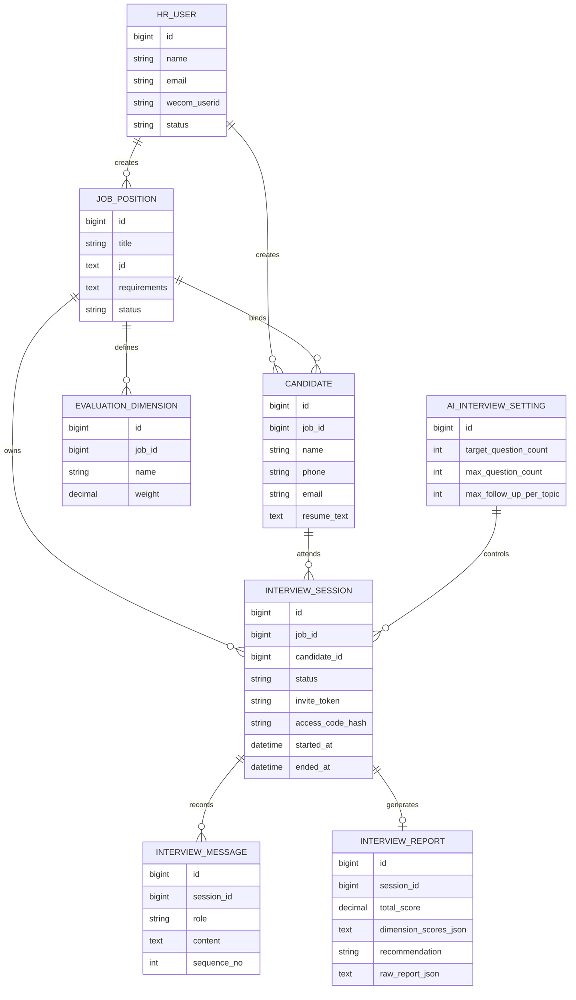
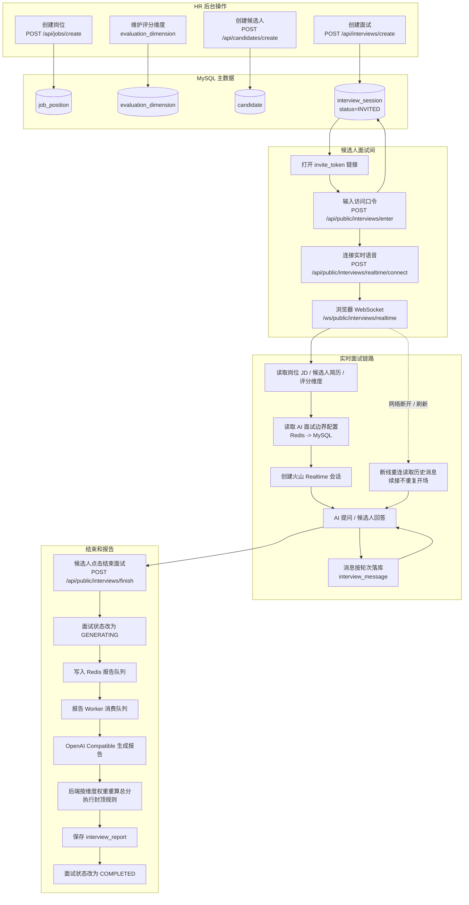
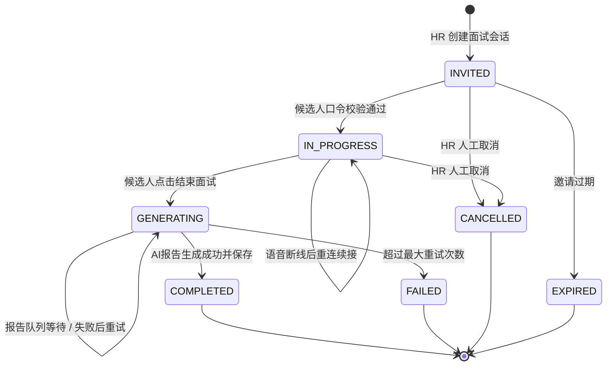
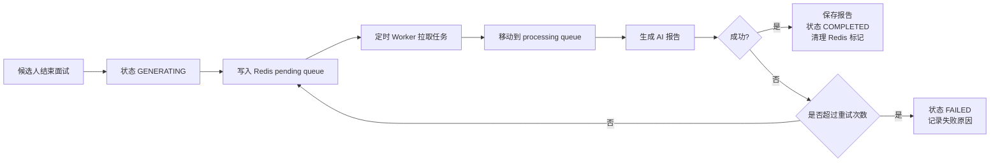

# hr-interview-api

奢享家 HR AI 面试系统后端。系统用于岗位录入、候选人简历管理、面试邀请、AI 实时语音面试、断线续接、面试对话留痕、AI 评分报告生成和后台权限管理。

## 技术栈

- Java 17
- Spring Boot 2.7
- MyBatis-Plus
- Swagger2 / Knife4j
- MySQL
- Druid 数据库连接池
- Redis
- WebSocket
- 火山引擎 Realtime 实时语音对话
- OpenAI Compatible Chat Completions
- 企业微信登录

## 项目约定

- 所有业务接口使用 `POST`
- 所有接口统一返回 `ApiResponse`
- 所有业务异常抛 `BusinessException`
- 所有异常通过 `GlobalExceptionHandler` 统一响应
- ORM 使用 MyBatis-Plus，尽可能不创建 XML mapper
- Controller、实体、请求 DTO、响应 DTO 使用 Swagger2 注解
- 所有实体/DTO 字段必须有 `@ApiModelProperty`
- 所有带 `controller` 的业务模块统一放在 `interfaces` 包下
- Service 接口放在 `service`，实现类统一放在 `service/impl`
- Service 注入统一使用 `@Resource`
- 工具类统一放在 `utils` 包，不放在 `common` 包
- 业务缓存、临时状态、队列、锁、计数器统一使用 Redis
- 日志统一使用 `logback-spring.xml` 标准化输出，日志字段包含时间、级别、线程、traceId、logger、消息和异常堆栈

## 项目架构图



## 后端目录结构

```text
com.zook.hrinterview
├── common
│   ├── constant
│   └── enums
│       └── RedisKeyEnum.java
├── component
│   └── ai
│       ├── interview
│       └── openai
├── config
├── interfaces
│   ├── auth
│   │   ├── controller
│   │   ├── dto
│   │   ├── entity
│   │   ├── mapper
│   │   └── service
│   │       └── impl
│   ├── candidate
│   ├── interview
│   ├── job
│   └── setting
├── realtime
│   ├── handler
│   ├── protocol
│   ├── service
│   ├── session
│   └── socket
└── utils
```

## 核心模块说明

| 模块 | 说明 |
|---|---|
| `interfaces.auth` | 用户登录、企业微信登录、JWT、RBAC 菜单/接口权限 |
| `interfaces.job` | 岗位 JD、能力要求、岗位评分维度 |
| `interfaces.candidate` | 候选人资料、简历文本、PDF 简历解析 |
| `interfaces.interview` | 面试创建、邀请口令、面试消息、报告列表和报告详情 |
| `interfaces.setting` | AI 面试边界配置，控制提问数量、追问深度和评分封顶 |
| `realtime` | 候选人面试间 WebSocket、火山 Realtime 连接、断线续接、实时消息入库 |
| `component.ai.interview` | OpenAI Compatible 面试报告生成、维度加权评分、后端封顶校准 |
| `utils.RedisUtils` | Redis 统一访问工具 |
| `common.enums.RedisKeyEnum` | Redis key、说明和 TTL 统一管理 |

## 数据库初始化

SQL 统一入口只保留一个文件：

```text
sql/init_schema.sql
```

这个文件包含：

- 数据库创建
- 全量业务表创建
- 企业微信登录字段
- 面试性能索引
- AI 面试配置表
- RBAC 菜单、接口权限、默认角色授权
- 旧库缺失字段和缺失索引的兜底补齐

新环境或测试环境执行：

```bash
mysql -h <host> -u <user> -p < sql/init_schema.sql
```

旧环境升级也优先执行同一个文件。脚本内部会通过 `add_column_if_missing` 和 `add_index_if_missing` 尽量避免重复字段和重复索引问题。

## 核心数据关系



## 岗位到报告完整数据流



### 每一步数据写入和状态变化

| 步骤 | 触发动作 | 主要数据表 | Redis/外部服务 | 状态变化 |
|---|---|---|---|---|
| 1 | HR 创建岗位 | `job_position` | - | 岗位 `ENABLED` |
| 2 | HR 配置评分维度 | `evaluation_dimension` | - | 维度跟随岗位 |
| 3 | HR 创建候选人 | `candidate` | - | 候选人绑定岗位 |
| 4 | HR 创建面试 | `interview_session` | `INTERVIEW_PUBLIC_TOKEN` 可缓存 token 映射 | `INVITED` |
| 5 | 候选人输入口令 | `interview_session.started_at` | `INTERVIEW_PUBLIC_ACCESS` 缓存校验通过态 | `INVITED -> IN_PROGRESS` |
| 6 | 候选人连接语音 | - | `INTERVIEW_REALTIME_TICKET`、在线人数、session-socket 映射 | 状态保持 `IN_PROGRESS` |
| 7 | AI 面试对话 | `interview_message` | 火山 Realtime；`INTERVIEW_MESSAGE_SEQUENCE` 保证消息序号 | 状态保持 `IN_PROGRESS` |
| 8 | 断线续接 | 读取 `interview_message` | 重新申请实时语音 ticket | 状态保持 `IN_PROGRESS` |
| 9 | 候选人结束面试 | `interview_session.ended_at` | `INTERVIEW_REPORT_PENDING_QUEUE` 入队 | `IN_PROGRESS -> GENERATING` |
| 10 | Worker 生成报告 | `interview_report` | OpenAI Compatible；报告锁、队列标记、重试计数 | `GENERATING -> COMPLETED` |
| 11 | 报告失败 | `interview_session.fail_reason` | 达到最大重试次数后清理队列标记 | `GENERATING -> FAILED` |

## 面试状态流



| 状态 | 含义 |
|---|---|
| `INVITED` | 已创建邀请，候选人还没有开始 |
| `IN_PROGRESS` | 候选人已进入面试，实时语音可连接 |
| `GENERATING` | 面试已结束，报告在 Redis 队列中等待或生成中 |
| `COMPLETED` | 报告生成完成，可以查看报告和对话 |
| `FAILED` | 报告生成失败，已记录失败原因 |
| `CANCELLED` | 已取消 |
| `EXPIRED` | 已过期 |

## AI 提问边界和评分边界

AI 面试边界可以在后台 `AI面试配置` 页面维护，配置落库到 `ai_interview_setting`，并缓存到 Redis。

读取规则：

```text
先读 Redis
Redis 没有 -> 查 MySQL
MySQL 查到 -> 回写 Redis
后台保存配置 -> 更新 MySQL -> 覆盖 Redis
```

主要配置：

| 字段 | 作用 |
|---|---|
| `targetQuestionCount` | 目标提问数量，AI 接近该数量后开始收尾 |
| `maxQuestionCount` | 最大提问数量，达到后后端硬性阻止继续追问 |
| `closingFollowUpTurnLimit` | 达到最大提问数后，允许候选人补充说明或反问的轮次数；0 表示答完最后一个正式问题后直接自动结束 |
| `maxFollowUpPerTopic` | 同一能力点或同一项目连续追问上限 |
| `minEffectiveAnswerCount` | 最低有效回答轮次，低于该值触发低可信面试封顶 |
| `insufficientAnswerMaxScore` | 有效回答不足时最高总分 |
| `noEvidenceMaxScore` | 没有真实案例、流程、工具、数据或处理细节时最高总分 |
| `weakJobMatchMaxScore` | 岗位匹配度低时最高总分 |
| `weakAnswerMaxScore` | 回答有效性明显不足时最高总分 |

提问规则：

- 每次只问一个问题
- 优先覆盖岗位评分维度
- 同一话题不能无限深挖
- 接近目标问题数后进入收尾
- 达到最大问题数后不再继续提问
- 断线续接时读取历史对话，不重复自我介绍

评分规则：

- AI 必须按岗位评分维度和权重输出分数
- 总分由后端按维度权重重新计算
- 后端再执行封顶规则，避免 AI 误打高分
- 简历只作为辅助证据，主要依据本次面试回答

## Redis 使用说明

所有缓存、临时状态、队列、锁和计数器统一在 `RedisKeyEnum` 定义。

关键 Redis key：

| key 枚举 | 用途 |
|---|---|
| `AUTH_LOGIN_TOKEN` | 登录 token 白名单 |
| `AUTH_WECOM_STATE` | 企业微信扫码登录 state |
| `AUTH_WECOM_ACCESS_TOKEN` | 企业微信 access_token |
| `RBAC_PERMISSION_LIST` | RBAC 权限列表缓存 |
| `AI_INTERVIEW_SETTING` | AI 面试边界配置缓存 |
| `INTERVIEW_PUBLIC_TOKEN` | 公开面试 token 到面试 ID 缓存 |
| `INTERVIEW_PUBLIC_ACCESS` | 面试口令校验通过缓存 |
| `INTERVIEW_REALTIME_TICKET` | Realtime 一次性连接票据 |
| `INTERVIEW_REALTIME_ONLINE_SESSIONS` | 当前在线实时面试集合 |
| `INTERVIEW_REALTIME_SESSION_SOCKET` | 面试会话到 WebSocket ID 映射 |
| `INTERVIEW_MESSAGE_SEQUENCE` | 面试消息顺序号计数器 |
| `INTERVIEW_REPORT_PENDING_QUEUE` | 面试报告待生成队列 |
| `INTERVIEW_REPORT_PROCESSING_QUEUE` | 面试报告生成中队列 |
| `INTERVIEW_REPORT_GENERATE_LOCK` | 面试报告生成锁 |
| `INTERVIEW_REPORT_QUEUE_FLAG` | 面试报告排队去重标记 |
| `INTERVIEW_REPORT_RETRY_COUNT` | 面试报告重试次数 |

## 报告生成队列

面试结束后不会在请求线程里直接等待 AI 报告生成，而是进入 Redis 队列。



配置位置：

```yaml
interview:
  report:
    queue:
      enabled: true
      poll-interval-millis: 3000
      batch-size: 1
      max-retry-times: 2
      recover-processing-on-startup: true
      startup-recover-limit: 200
```

## 环境配置

默认启用 `test` 环境：

```yaml
spring:
  profiles:
    active: test
```

配置文件：

- `application.yml`：公共配置
- `application-test.yml`：测试环境配置
- `application-prod.yml`：生产环境配置

主要配置项：

- MySQL：`spring.datasource`
- Redis：`spring.redis`
- JWT：`security.jwt`
- 企业微信：`wecom`
- 火山实时语音：`volcengine.realtime`
- OpenAI Compatible：`openai.chat`
- AI 报告：`ai.interview-report`
- 实时面试并发：`interview.realtime.capacity`
- 报告队列：`interview.report.queue`
